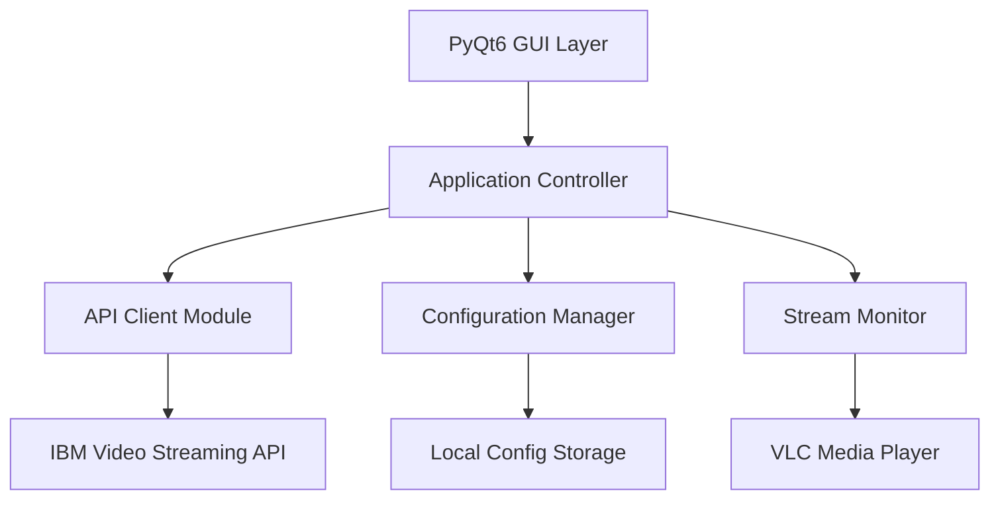
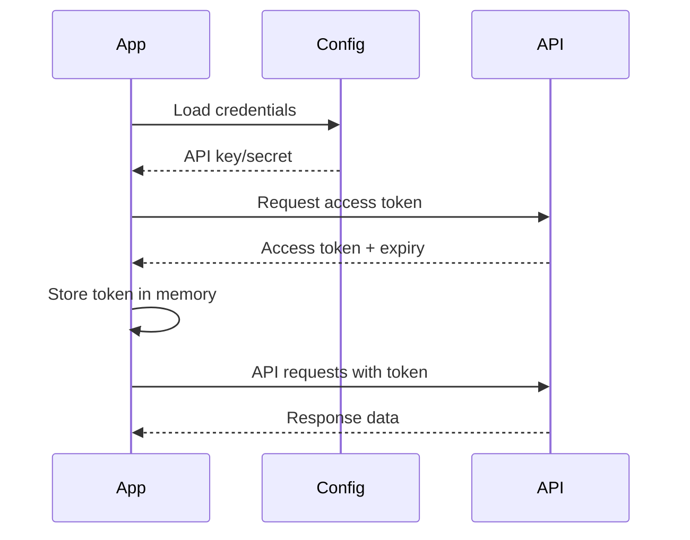

# IBM Video Streaming API Manager - Technical Plan

## Project Overview

A cross-platform desktop application for managing IBM Video Streaming services through their API. Built with Python and PyQt6, supporting both macOS and Windows.

## Technology Stack

- **Language**: Python 3.9+
- **GUI Framework**: PyQt6
- **HTTP Client**: requests library
- **Video Player**: VLC Python bindings (python-vlc)
- **Data Visualization**: matplotlib, pyqtgraph
- **Configuration**: python-dotenv, configparser
- **Packaging**: PyInstaller

## Architecture

### High-Level Architecture



### Module Structure

```
ibm-video-manager/
├── src/
│   ├── main.py                 # Application entry point
│   ├── api/
│   │   ├── __init__.py
│   │   ├── client.py          # Base API client
│   │   ├── channels.py        # Channel management
│   │   ├── videos.py          # Video management
│   │   ├── players.py         # Player configuration
│   │   ├── interactivity.py   # Chat, polls, Q&A
│   │   └── analytics.py       # Analytics and metrics
│   ├── ui/
│   │   ├── __init__.py
│   │   ├── main_window.py     # Main application window
│   │   ├── channels_panel.py  # Channel management UI
│   │   ├── videos_panel.py    # Video management UI
│   │   ├── players_panel.py   # Player settings UI
│   │   ├── interactive_panel.py # Interactivity controls
│   │   ├── monitor_panel.py   # Stream monitoring dashboard
│   │   └── widgets/           # Reusable UI components
│   ├── core/
│   │   ├── __init__.py
│   │   ├── config.py          # Configuration management
│   │   ├── auth.py            # Authentication handler
│   │   └── logger.py          # Logging setup
│   └── utils/
│       ├── __init__.py
│       ├── validators.py      # Input validation
│       └── helpers.py         # Utility functions
├── resources/
│   ├── icons/                 # Application icons
│   └── styles/                # QSS stylesheets
├── tests/
│   ├── test_api/
│   └── test_ui/
├── docs/
│   └── USER_GUIDE.md
├── requirements.txt
├── setup.py
└── README.md
```

## Core Components

### 1. API Client Module

**Purpose**: Handle all communication with IBM Video Streaming API

**Key Classes**:
- `IBMVideoClient`: Base client with authentication
- `ChannelManager`: CRUD operations for channels
- `VideoManager`: Video upload, delete, modify
- `PlayerManager`: Player configuration
- `InteractivityManager`: Chat, polls, Q&A management
- `AnalyticsManager`: Fetch metrics and analytics

**Key Features**:
- OAuth 2.0 authentication
- Rate limiting and retry logic
- Request/response logging
- Error handling with custom exceptions

### 2. GUI Layer (PyQt6)

**Main Window Layout**:
```
┌─────────────────────────────────────────────┐
│  IBM Video Streaming Manager    [_][□][X]  │
├─────────────────────────────────────────────┤
│ File  Edit  View  Tools  Help              │
├──────────┬──────────────────────────────────┤
│          │                                  │
│ Channels │  Channel Management Panel        │
│ Videos   │  - List channels                 │
│ Players  │  - Create/Edit/Delete            │
│ Interactive│ - Configure settings           │
│ Monitor  │                                  │
│ Settings │                                  │
│          │                                  │
└──────────┴──────────────────────────────────┘
```

**UI Panels**:

1. **Channels Panel**
   - List view with search/filter
   - Create new channel dialog
   - Edit channel properties
   - Delete with confirmation
   - Broadcast settings

2. **Videos Panel**
   - Video library grid/list view
   - Upload video with progress
   - Edit metadata
   - Delete videos
   - Playlist management

3. **Players Panel**
   - Player configuration list
   - Customize player appearance
   - Embed code generation
   - Preview player

4. **Interactive Panel**
   - Enable/disable chat
   - Configure polls
   - Manage Q&A sessions
   - Moderation tools

5. **Monitor Panel**
   - Live stream preview (VLC embedded)
   - Real-time viewer count
   - Analytics charts (viewers over time)
   - Stream health metrics
   - Multi-channel monitoring

### 3. Configuration Management

**Configuration Storage**:
- API credentials (encrypted)
- User preferences
- Recent channels/videos
- Window state and layout

**File Format**: JSON with encryption for sensitive data

### 4. Stream Monitoring

**Features**:
- Embed VLC player for stream preview
- Poll API for real-time metrics
- Display viewer count, bitrate, health
- Alert on stream issues
- Historical data visualization

## API Integration Details

### Authentication Flow



### Key API Endpoints to Implement

**Channel Management**:
- `GET /users/self/channels.json` - List channels
- `POST /users/self/channels.json` - Create channel
- `PUT /channels/{channelId}.json` - Update channel
- `DELETE /channels/{channelId}.json` - Delete channel
- `GET /channels/{channelId}.json` - Get channel details

**Video Management**:
- `GET /channels/{channelId}/videos.json` - List videos
- `POST /channels/{channelId}/videos.json` - Upload video
- `PUT /videos/{videoId}.json` - Update video
- `DELETE /videos/{videoId}.json` - Delete video

**Player Configuration**:
- `GET /channels/{channelId}/settings/player.json` - Get player settings
- `PUT /channels/{channelId}/settings/player.json` - Update player

**Interactivity**:
- `GET /channels/{channelId}/settings/chat.json` - Chat settings
- `PUT /channels/{channelId}/settings/chat.json` - Update chat
- `GET /channels/{channelId}/polls.json` - List polls
- `POST /channels/{channelId}/polls.json` - Create poll

**Analytics**:
- `GET /channels/{channelId}/metrics.json` - Get metrics
- `GET /channels/{channelId}/viewers.json` - Current viewers

## Data Models

### Channel Model
```python
@dataclass
class Channel:
    id: str
    title: str
    description: str
    url: str
    status: str  # live, offline, recorded
    viewer_count: int
    created_at: datetime
    settings: dict
```

### Video Model
```python
@dataclass
class Video:
    id: str
    channel_id: str
    title: str
    description: str
    duration: int
    thumbnail_url: str
    views: int
    created_at: datetime
    status: str  # processing, ready, error
```

### Player Config Model
```python
@dataclass
class PlayerConfig:
    channel_id: str
    autoplay: bool
    controls: bool
    responsive: bool
    color_scheme: str
    logo_url: str
```

## Error Handling Strategy

1. **API Errors**: Custom exception classes for different HTTP status codes
2. **Network Errors**: Retry logic with exponential backoff
3. **UI Errors**: User-friendly error dialogs with details
4. **Logging**: Comprehensive logging to file and console

## Security Considerations

1. **Credential Storage**: Encrypt API keys using keyring library
2. **HTTPS Only**: All API communication over HTTPS
3. **Token Management**: Secure token storage in memory
4. **Input Validation**: Validate all user inputs
5. **Rate Limiting**: Respect API rate limits

## Performance Optimization

1. **Async Operations**: Use QThread for API calls to prevent UI blocking
2. **Caching**: Cache channel/video lists with TTL
3. **Lazy Loading**: Load data on-demand
4. **Connection Pooling**: Reuse HTTP connections
5. **Image Optimization**: Cache and resize thumbnails

## Testing Strategy

1. **Unit Tests**: Test API client methods
2. **Integration Tests**: Test API integration
3. **UI Tests**: Test UI components
4. **Manual Testing**: Test on both macOS and Windows

## Packaging and Distribution

### macOS
- Create .app bundle using PyInstaller
- Code signing (optional)
- DMG installer

### Windows
- Create .exe using PyInstaller
- NSIS installer
- Optional: Windows Store package

## Development Phases

### Phase 1: Foundation (Tasks 1-3)
- Project setup
- API client base
- Authentication

### Phase 2: Core API Features (Tasks 4-7)
- Channel management
- Video management
- Player configuration
- Interactivity controls

### Phase 3: Monitoring (Tasks 8-9)
- Stream monitoring
- Analytics dashboard

### Phase 4: UI Development (Tasks 10-15)
- Main window
- All UI panels
- Integration with API

### Phase 5: Polish (Tasks 16-18)
- Settings management
- Error handling
- Documentation

### Phase 6: Testing & Distribution (Tasks 19-21)
- Platform testing
- Packaging
- Distribution

## Dependencies

```
PyQt6>=6.6.0
requests>=2.31.0
python-vlc>=3.0.0
matplotlib>=3.8.0
pyqtgraph>=0.13.0
python-dotenv>=1.0.0
keyring>=24.0.0
cryptography>=41.0.0
PyInstaller>=6.0.0
pytest>=7.4.0
```

## Timeline Estimate

- **Phase 1**: 2-3 days
- **Phase 2**: 5-7 days
- **Phase 3**: 3-4 days
- **Phase 4**: 7-10 days
- **Phase 5**: 2-3 days
- **Phase 6**: 3-4 days

**Total**: 22-31 days (approximately 4-6 weeks)

## Success Criteria

1. ✅ Successfully authenticate with IBM Video Streaming API
2. ✅ Create, read, update, delete channels
3. ✅ Upload and manage videos
4. ✅ Configure player settings
5. ✅ Enable/disable interactivity features
6. ✅ Monitor live streams with preview
7. ✅ Display analytics and metrics
8. ✅ Runs on both macOS and Windows
9. ✅ User-friendly interface
10. ✅ Comprehensive error handling

## Future Enhancements

- Multi-account support
- Batch operations
- Scheduled streaming
- Advanced analytics with export
- Mobile companion app
- Plugin system for extensions